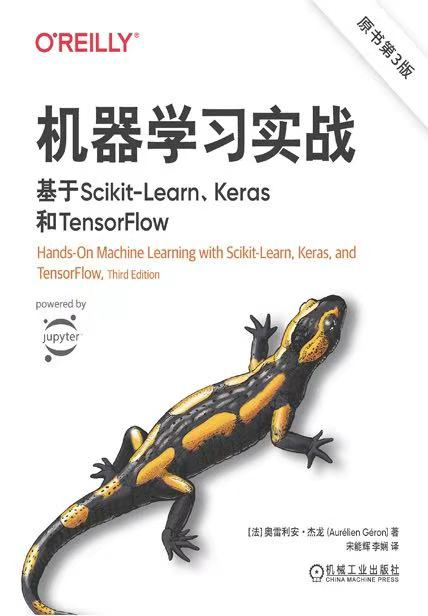

# Machine Learning Blog

## Personal Environment Setup

### Development Tools
1. **IDE**: VSCode
2. **Essential Plugins**:
   - Implementation Plugins:
     - Jupyter
     - Python
     - Pylance
   - Debugging Plugins:
     - Jupyter Debugger

### Reference textbook
- 

- 

### Reference videos
[机器学习入门到精通](https://www.bilibili.com/video/BV1PN4y1V7d9/?vd_source=409d253abbce60cddf6494969d7904bf)

### Dependency Installation
- TODO: Add demo project dependencies(install sklearn, seaborn)

---

## TODO Topics
1. [**Start from Basic Terminology**](https://github.com/mithra-chips/ML_blog/issues/1)
2. [**The Essence of Linear Regression**](https://github.com/mithra-chips/ML_blog/issues/2#issue-3008600106)
    - [**Error and loss function**](https://github.com/mithra-chips/ML_blog/issues/3)
    - [**Optimization**](https://github.com/mithra-chips/ML_blog/issues/4)
    - [**Practice 1**](https://github.com/mithra-chips/ML_blog/issues/5)
3. **L2 Regularized Linear Regression**
